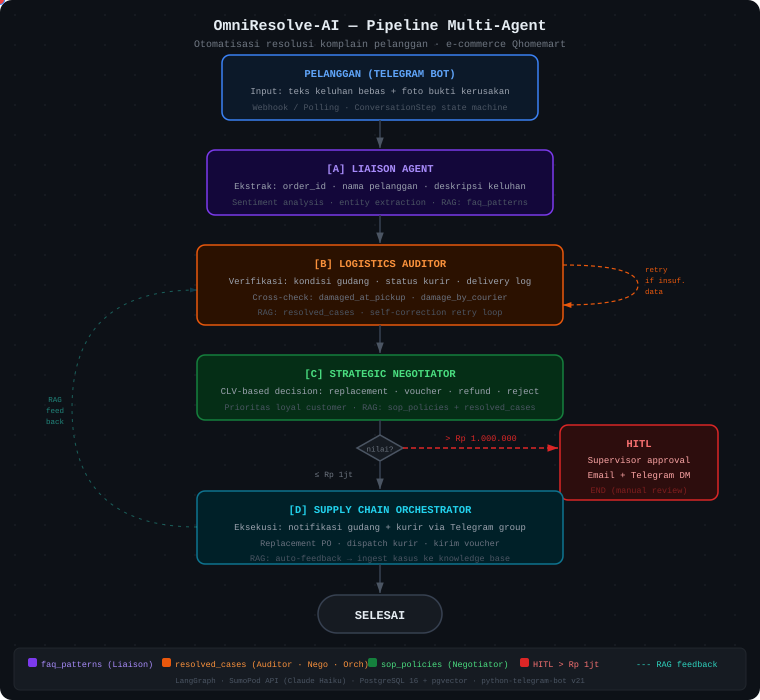

#  OmniResolve-AI

**Autonomous Omni-Channel Retail Concierge & Conflict Resolver**

Sistem Multi-Agent berbasis **ReAct (Reason + Act)** + **LangGraph** untuk automasi resolusi konflik pelanggan dan optimalisasi inventaris real-time di industri ritel. Dilengkapi sistem **RAG (Retrieval-Augmented Generation)** yang terus belajar dari setiap kasus yang diselesaikan.

### Live Links (Telegram)
- **Bot Telegram (Deployed di SumoPod):** [@OmniResolBot](https://t.me/OmniResolBot)
- **Grup Gudang:** [t.me/gudangomniresolve](https://t.me/gudangomniresolve)
- **Grup Kurir:** [t.me/kuriromniresolve](https://t.me/kuriromniresolve)

---

## Visualisasi Alur Pipeline

> Diagram animasi berikut menunjukkan alur data dari keluhan masuk hingga resolusi otomatis. Titik biru bergerak mengikuti jalur utama; titik merah mewakili kasus HITL (nilai > Rp 1 juta).



---

## Arsitektur

### Pipeline Multi-Agent

```
Pelanggan (via Telegram Bot)
    │
    ▼
[A] Liaison Agent          ← Sentiment analysis + entity extraction
    │   ↑ RAG: faq_patterns
    ▼
[B] Logistics Auditor      ← Cross-check CCTV, kurir, stok (self-correction loop)
    │   ↑ RAG: resolved_cases
    ▼
[C] Strategic Negotiator   ← CLV-based decision (voucher / replacement / refund)
    │   ↑ RAG: sop_policies + resolved_cases
    ├─ (HITL) ─▶ Supervisor Notification (jika kompensasi > Rp 1.000.000) → END
    │
    ▼
[D] Supply Chain Orchestrator  ← ERP update + dispatch kurir + trigger PO
    │   ↑ RAG: resolved_cases
    ▼
[E] RAG Feedback Node      ← Auto-ingest kasus ke knowledge base → END
```

### Sistem RAG (Pembelajaran Berkelanjutan)

```
Knowledge Base (pgvector)
┌─────────────────────────────────────────────────────────────┐
│  Collection          │ Sumber             │ Dipakai oleh    │
│──────────────────────┼────────────────────┼─────────────────│
│  sop_policies        │ Manual admin       │ Negotiator      │
│  resolved_cases      │ AUTO (feedback)    │ Auditor, Nego,  │
│                      │                    │ Orchestrator    │
│  faq_patterns        │ Manual + auto      │ Liaison         │
│  product_catalog     │ Manual admin       │ (semua agen)    │
└─────────────────────────────────────────────────────────────┘
         ▲                          │
         │ ingest                   │ retrieve (similarity search)
         │                          ▼
    [RAG Feedback]           [Setiap LLM call]
    Setelah setiap           Agen mendapat konteks
    kasus selesai            domain-spesifik
```

---

## Key Features

| Feature | Deskripsi |
|---|---|
| **Collaborative Reasoning** | 4 agen saling berbagi state via LangGraph State-Graph |
| **Self-Correction** | Auditor dapat loop kembali jika data belum conclusive |
| **CLV-Based Decisions** | Keputusan kompensasi berbasis Customer Lifetime Value |
| **Human-in-the-Loop** | Auto-notifikasi supervisor untuk kompensasi > Rp 1.000.000 |
| **RAG Continuous Learning** | Knowledge base tumbuh otomatis dari setiap kasus selesai |
| **Domain Guardrails** | Agen menolak pertanyaan di luar lingkup Qhomemart |
| **Traceability (CoT)** | Setiap keputusan memiliki Chain of Thought yang dapat diinspeksi |
| **Telegram Bot** | Interface pelanggan via Telegram (polling/webhook) |
| **Admin Knowledge API** | REST API untuk mengelola knowledge base secara manual |

---

## Tech Stack

| Layer | Teknologi |
|---|---|
| **Orchestration** | LangGraph (Stateful Multi-Agent) |
| **LLM** | SumoPod API Marketplace (Anthropic Claude / GLM — OpenAI-compatible) |
| **Vector DB** | pgvector (PostgreSQL extension) |
| **Database** | PostgreSQL 16 |
| **API** | FastAPI + Swagger |
| **Interface** | Telegram Bot (python-telegram-bot v21) |
| **Container** | Docker / Podman (kompatibel, SELinux-aware) |
| **Deployment** | SumoPod |

---

## Quick Start

### Prerequisites

- Podman atau Docker
- `podman-compose` atau `docker compose`
- API key dari [SumoPod Marketplace](https://sumopod.com)
- Telegram Bot token dari [@BotFather](https://t.me/BotFather)

### 1. Clone & Setup Environment

```bash
git clone https://github.com/AgungDwiPangestu/OmniResolve-AI.git
cd OmniResolve-AI

# Buat file .env dari template
cp .env.example .env
```

Edit `.env` dan isi variabel berikut (minimal):

```env
# LLM — dari SumoPod API Marketplace
LLM_BASE_URL=https://api.sumopod.com/v1
LLM_API_KEY=your-sumopod-api-key
LLM_MODEL_NAME=claude-3-haiku-20240307

# Telegram Bot — dari @BotFather
TELEGRAM_BOT_TOKEN=your-telegram-bot-token
TELEGRAM_MODE=polling   # polling untuk dev, webhook untuk production
```

---

## Menjalankan Container

### Start — Pertama Kali atau Setelah Update Kode

> Gunakan `--build` untuk rebuild image saat ada perubahan kode atau `requirements.txt`

**Podman:**
```bash
podman-compose up --build -d
```

**Docker:**
```bash
docker compose up --build -d
```

Flag `-d` artinya *detached* (berjalan di background).

---

### Start — Tanpa Rebuild (Container Sudah Ada)

**Podman:**
```bash
podman-compose up -d
```

**Docker:**
```bash
docker compose up -d
```

---

### Restart Container

**Restart semua service:**

```bash
# Podman
podman-compose restart

# Docker
docker compose restart
```

**Restart satu service saja:**

```bash
# Podman
podman-compose restart api

# Docker
docker compose restart api
```

---

### Stop Container

```bash
# Podman
podman-compose down

# Docker
docker compose down
```

> `down` menghentikan dan menghapus container, tapi **data PostgreSQL tetap aman** di volume `postgres_data`.

---

### Reset Total (hapus data + rebuild dari awal)

```bash
# Podman
podman-compose down -v && podman-compose up --build -d

# Docker
docker compose down -v && docker compose up --build -d
```

> ⚠️ Flag `-v` menghapus volume — **data PostgreSQL akan hilang**.

---

### Cek Status & Log

```bash
# Lihat status semua container
podman ps

# Lihat log real-time API
podman logs -f omni_api

# Lihat log real-time Postgres
podman logs -f omni_postgres

# Hanya 50 baris terakhir
podman logs --tail 50 omni_api
```

---

### Akses Setelah Container Jalan

| Service | URL |
|---|---|
| **API Docs (Swagger)** | http://localhost:8000/docs |
| **Health Check** | http://localhost:8000/health |
| **Telegram Bot Info** | http://localhost:8000/api/v1/telegram/info |
| **Chat Endpoint** | http://localhost:8000/api/v1/chat/completions |
| **Complaints Endpoint** | http://localhost:8000/api/v1/complaints |
| **Knowledge Base Admin** | http://localhost:8000/api/v1/admin/knowledge/stats |

---

## Setup Telegram Bot

1. Buka Telegram → cari **@BotFather**
2. Kirim `/newbot` → ikuti instruksi → salin **token**
3. Isi `TELEGRAM_BOT_TOKEN=<token>` di `.env`
4. Restart API: `podman-compose restart api`
5. Cek bot aktif: `curl http://localhost:8000/api/v1/telegram/info`

**Cari tahu Chat ID kamu** (untuk notifikasi HITL supervisor):
- Kirim pesan ke bot [@userinfobot](https://t.me/userinfobot)
- Salin ID → isi `TELEGRAM_ADMIN_CHAT_ID=<id>` di `.env`

---

## Ganti Email Supervisor (HITL Notification)

Ketika nilai kompensasi melebihi Rp 1.000.000, sistem secara otomatis mengirim email notifikasi ke supervisor untuk approval manual. Alamat email tujuan di-hardcode di:

**File:** `src/agents/supply_chain_orchestrator.py`  
**Baris:** 348

```python
managers = ["haris.sandi23@students.utdi.ac.id", "agung.dwi23@students.utdi.ac.id"]
```

Ganti daftar email tersebut dengan alamat email penguji/juri yang ingin menerima notifikasi. Boleh satu atau lebih email:

```python
managers = ["email-anda@domain.com"]
```

Setelah mengganti, rebuild image dan deploy ulang:

```bash
# Podman (lokal):
podman-compose build api && podman-compose up -d api

# Docker (VPS):
docker compose build api && docker compose up -d api
```

> Pastikan variabel SMTP di `.env` sudah dikonfigurasi (`SMTP_HOST`, `SMTP_PORT`, `SMTP_USER`, `SMTP_PASS`) agar email berhasil terkirim.

---

## Koneksi ke Frontend (OpenAI-Compatible)

Arahkan frontend atau tool apapun ke backend ini:

- **Base URL:** `http://localhost:8000/api/v1`
- **API Key:** isi nilai apapun (dev mode tidak butuh auth)
- **Model:** `omni-resolve-ai`

---

## Database Management (Seed Data Qhomemart)

Proyek ini dilengkapi dengan skema tabel (ERP/CRM) dan data *dummy* spesifik Qhomemart.

```
db/init.sql  → Skema tabel: customers, products, orders, dll
db/seed.sql  → Data dummy: Budi Hartono, Cat Dulux, Kloset, dll
```

Untuk me-reset isi database:

```bash
# Podman:
podman exec -i omni_postgres psql -U omni_user -d omni_resolve < db/init.sql
podman exec -i omni_postgres psql -U omni_user -d omni_resolve < db/seed.sql

# Docker:
docker exec -i omni_postgres psql -U omni_user -d omni_resolve < db/init.sql
docker exec -i omni_postgres psql -U omni_user -d omni_resolve < db/seed.sql
```

*Catatan: `seed.sql` aman dijalankan berulang kali (menggunakan `TRUNCATE`).*

---

## RAG & Knowledge Base (Pembelajaran Berkelanjutan)

Sistem RAG memungkinkan agen AI terus belajar dari setiap kasus yang diselesaikan, tanpa perlu fine-tuning model. Pengetahuan tersimpan di pgvector dan diambil secara dinamis saat LLM dipanggil.

### Cara Kerja

1. **Pelanggan mengajukan keluhan** → pipeline berjalan
2. **Setiap agen** mengambil konteks relevan dari knowledge base *sebelum* memanggil LLM
3. **Setelah kasus selesai**, Supply Chain Orchestrator otomatis menyimpan ringkasan kasus ke `resolved_cases`
4. **Kasus berikutnya** → agen menemukan preseden ini → keputusan lebih akurat dan konsisten

### 4 Collection Knowledge Base

| Collection | Berisi | Diisi Oleh |
|---|---|---|
| `sop_policies` | Kebijakan kompensasi, SOP Qhomemart, aturan HITL | Admin (manual) |
| `resolved_cases` | Ringkasan kasus yang berhasil diselesaikan | **Otomatis** (feedback loop) |
| `faq_patterns` | Pola keluhan umum, guardrail off-topic | Admin (manual) |
| `product_catalog` | Info produk, garansi, kategori | Admin (manual) |

### Setup Pertama Kali — Seed Knowledge Base

Setelah container berjalan, **wajib** menjalankan seed untuk mengisi knowledge base dengan data awal:

```bash
# Via curl:
curl -X POST http://localhost:8000/api/v1/admin/knowledge/seed

# Atau via Swagger UI:
# Buka http://localhost:8000/docs → cari "Knowledge Base (RAG)" → POST /admin/knowledge/seed → Execute
```

Output yang diharapkan:
```json
{
  "message": "Knowledge base berhasil di-seed.",
  "results": {
    "sop_policies": 7,
    "faq_patterns": 5,
    "product_catalog": 3,
    "resolved_cases": 0
  },
  "total_ingested": 15
}
```

> `resolved_cases` dimulai 0 — akan terisi otomatis setiap kali ada kasus selesai diproses.

---

### Endpoint Admin Knowledge Base

Semua endpoint tersedia di Swagger: `http://localhost:8000/docs` → seksi **Knowledge Base (RAG)**

#### Cek Statistik

```bash
curl http://localhost:8000/api/v1/admin/knowledge/stats
```

```json
{
  "collections": {
    "sop_policies": {"description": "Kebijakan dan SOP bisnis Qhomemart", "document_count": 7},
    "resolved_cases": {"description": "Riwayat kasus komplain yang berhasil diselesaikan", "document_count": 12},
    "faq_patterns": {"description": "Pola keluhan umum dan respons yang tepat", "document_count": 5},
    "product_catalog": {"description": "Informasi produk, kategori, dan FAQ terkait produk", "document_count": 3}
  }
}
```

#### Tambah Dokumen Baru (SOP / FAQ)

Misalnya Anda ingin menambahkan kebijakan baru untuk produk keramik:

```bash
curl -X POST http://localhost:8000/api/v1/admin/knowledge/ingest \
  -H "Content-Type: application/json" \
  -d '{
    "collection": "sop_policies",
    "documents": [
      {
        "content": "Kebijakan khusus produk keramik: Keramik yang retak saat pengiriman mendapat penggantian penuh tanpa syarat, karena sifat produk yang sangat rentan. Tidak perlu foto sebagai bukti untuk klaim keretakan keramik.",
        "metadata": {
          "category": "special_policy",
          "product_type": "keramik",
          "version": "v1.0"
        }
      }
    ]
  }'
```

#### Tambah Pola FAQ Baru

```bash
curl -X POST http://localhost:8000/api/v1/admin/knowledge/ingest \
  -H "Content-Type: application/json" \
  -d '{
    "collection": "faq_patterns",
    "documents": [
      {
        "content": "Pola keluhan: Pelanggan mengeluh cat yang dibeli warnanya berbeda dengan di katalog online. Tipe: wrong_item. Respons: verifikasi kode warna di kemasan vs kode di order, jika berbeda proses penggantian sesuai SOP wrong_item.",
        "metadata": {
          "pattern_type": "wrong_item",
          "product_type": "cat",
          "keywords": "warna berbeda tidak sesuai katalog"
        }
      }
    ]
  }'
```

#### Hapus Collection (Reset)

```bash
# Hati-hati! Operasi ini tidak bisa dibatalkan.
curl -X DELETE http://localhost:8000/api/v1/admin/knowledge/resolved_cases
```

---

### Menambahkan Dokumen via File

Untuk menambahkan banyak dokumen sekaligus, Anda bisa membuat script Python:

```python
# scripts/ingest_sop.py
import asyncio
import httpx

async def main():
    documents = []

    # Baca dari file teks
    with open("sop_baru.txt", "r") as f:
        content = f.read()
    documents.append({
        "content": content,
        "metadata": {"source": "sop_baru.txt", "version": "v1.0"}
    })

    async with httpx.AsyncClient() as client:
        response = await client.post(
            "http://localhost:8000/api/v1/admin/knowledge/ingest",
            json={"collection": "sop_policies", "documents": documents}
        )
        print(response.json())

asyncio.run(main())
```

---

### Bagaimana Agen Menggunakan Knowledge Base

Setiap agen melakukan similarity search sebelum memanggil LLM:

```
Liaison Agent      → cari "faq_patterns" dengan teks keluhan pelanggan
                   → hasilnya ditambahkan ke system prompt sebagai
                     "REFERENSI POLA KELUHAN SERUPA"

Logistics Auditor  → cari "resolved_cases" dengan tipe + deskripsi keluhan
                   → hasilnya ditambahkan ke context sebagai
                     "PRESEDEN KASUS SERUPA (untuk referensi audit)"

Strategic          → cari "sop_policies" + "resolved_cases"
Negotiator         → hasilnya ditambahkan sebagai
                     "REFERENSI SOP" + "PRESEDEN KEPUTUSAN SERUPA"

Supply Chain       → cari "resolved_cases" dengan tipe keputusan
Orchestrator       → hasilnya ditambahkan sebagai
                     "REFERENSI POLA RESPONS KASUS SERUPA"
```

Dengan cara ini, semakin banyak kasus yang diproses, semakin kaya konteks yang tersedia, dan semakin akurat keputusan AI.

---

### Domain Guardrails

Semua agen memiliki batasan domain yang dibangun di dalam system prompt:

> "Kamu HANYA bertugas menangani keluhan dan pertanyaan terkait pesanan di Qhomemart. Jika pelanggan menanyakan hal di luar topik Qhomemart, tolak dengan sopan."

Ditambah pola FAQ `off_topic` di collection `faq_patterns` yang memperkuat batasan ini. Hasilnya, agen tidak akan menjawab pertanyaan seperti cuaca, politik, atau obrolan umum — hanya fokus pada tugas Qhomemart.

---

## Visualizer — Qhome Virtual Office

Dashboard real-time untuk monitoring pipeline agent, manajemen inventaris, dan analytics operasional. Berjalan di port **8001** (production: `https://omniresolve.pixelwar.tech`).

### Lantai & Akses

Visualizer memiliki **4 lantai**, masing-masing punya interface dan fungsi berbeda. Tiga lantai bersifat *restricted* dan memerlukan admin key.

| Lantai | Badge | Fungsi | Key |
|--------|-------|--------|-----|
| **Boss Room** | 3F | Dashboard eksekutif: statistik keluhan harian, resolved, rejected, pending approval, total kompensasi, estimasi penghematan, chart 7 hari | `BOSS-R7P2X-9KMW3-QHOME` |
| **Warehouse** | 2F | Inventory control: daftar stok produk (color-coded OK/Low/Depleted), filter & search, histori pergerakan stok masuk/keluar | `WHS-Q8K3N-5MBX7-QHOME` |
| **OmniResolve HQ** | 1F | Visualisasi kantor real-time: agen AI bergerak, sesi aktif, event log, agent state — tidak memerlukan key | — |
| **Archive** | B1 | RAG document upload: unggah file PDF/DOCX/MD/TXT untuk menambah konteks SOP atau knowledge base agen | `ARCH-Q9X3M-7KBW2-QHOME` |

> **Catatan keamanan:** Jangan commit file `visualizer/frontend/.env.local`. Key di atas untuk keperluan development. Di production, set sebagai Docker build args.

### Cara Deploy Visualizer

```bash
podman build \
  -t docker.io/<username>/omniresolve-visualizer:latest \
  --build-arg NEXT_PUBLIC_ARCHIVE_KEY=ARCH-Q9X3M-7KBW2-QHOME \
  --build-arg NEXT_PUBLIC_WAREHOUSE_KEY=WHS-Q8K3N-5MBX7-QHOME \
  --build-arg NEXT_PUBLIC_BOSS_KEY=BOSS-R7P2X-9KMW3-QHOME \
  --build-arg NEXT_PUBLIC_OMNI_API_URL=https://your-domain.com \
  --build-arg NEXT_PUBLIC_WS_URL=wss://your-domain.com \
  ./visualizer/
```

---


```bash
# Jalankan semua test
pytest tests/ -v

# Test via curl — Kasus A (pelanggan baru, barang murah)
curl -X POST http://localhost:8000/api/v1/complaints \
  -H "Content-Type: application/json" \
  -d '{"message": "Rak dinding saya warnanya salah. Order ORD-003. Customer CUST-002."}'

# Test via curl — Kasus B (pelanggan setia, barang mahal rusak)
curl -X POST http://localhost:8000/api/v1/complaints \
  -H "Content-Type: application/json" \
  -d '{"message": "Sofa saya rusak parah waktu diterima! Order ORD-004, Customer CUST-001."}'
```

---

## Struktur Proyek

```
OmniResolve-AI/
├── Dockerfile
├── docker-compose.yml
├── docker-compose.override.yml   ← dev overrides (hot-reload, SELinux :Z)
├── .env.example                  ← template env vars (JANGAN commit .env!)
├── requirements.txt
├── src/
│   ├── config.py                 ← centralized settings (pydantic-settings)
│   ├── agents/
│   │   ├── liaison_agent.py          ← Agent A: Front-End Intelligence + RAG faq_patterns
│   │   ├── logistics_auditor.py      ← Agent B: Deep Research + RAG resolved_cases
│   │   ├── strategic_negotiator.py   ← Agent C: CLV Decision Maker + RAG sop+cases
│   │   └── supply_chain_orchestrator.py ← Agent D: Action Executor + RAG resolved_cases
│   ├── graph/
│   │   ├── state.py              ← GraphState TypedDict (shared memory)
│   │   ├── workflow.py           ← LangGraph StateGraph builder
│   │   └── rag_feedback.py       ← Node post-resolution: auto-ingest ke knowledge base
│   ├── tools/
│   │   ├── inventory_tools.py    ← ERP inventory & customer profile
│   │   ├── courier_tools.py      ← courier API
│   │   ├── erp_tools.py          ← ERP actions (stock, PO, refund)
│   │   ├── vector_store.py       ← Multi-collection pgvector (4 namespaces)
│   │   └── knowledge_ingestion.py ← Ingestion pipeline + seed data + feedback loop
│   ├── telegram_bot/
│   │   ├── bot.py                ← entry point (polling / webhook)
│   │   ├── handlers.py           ← message, photo, command handlers
│   │   └── session.py            ← per-customer conversation state
│   └── api/
│       ├── main.py               ← FastAPI app + Telegram lifecycle
│       └── routers/
│           ├── health.py             ← GET /health
│           ├── complaints.py         ← POST /api/v1/complaints
│           ├── chat.py               ← POST /api/v1/chat/completions
│           ├── telegram_webhook.py   ← POST /api/v1/telegram/webhook
│           ├── diagnostic.py         ← Diagnostic endpoints
│           └── admin_knowledge.py    ← Knowledge Base Management (seed, ingest, stats)
├── db/
│   ├── init.sql                  ← schema + pgvector setup
│   └── seed.sql                  ← demo data (70 kasus Qhomemart)
└── tests/
    └── test_scenarios.py         ← demo scenarios (Kasus A & B)
```

---

## Deployment ke SumoPod

1. Push image ke registry:
   ```bash
   podman build -t omniresolve-ai:latest .
   podman push omniresolve-ai:latest docker.io/<username>/omniresolve-ai:latest
   ```

2. Di SumoPod dashboard, set environment variables (sama seperti `.env`)

3. Ubah mode Telegram ke webhook:
   ```env
   TELEGRAM_MODE=webhook
   TELEGRAM_WEBHOOK_URL=https://your-app.sumopod.com
   ```

4. Health check endpoint sudah siap: `GET /health`

5. **Jangan lupa seed knowledge base setelah deploy:**
   ```bash
   curl -X POST https://your-app.sumopod.com/api/v1/admin/knowledge/seed
   ```
